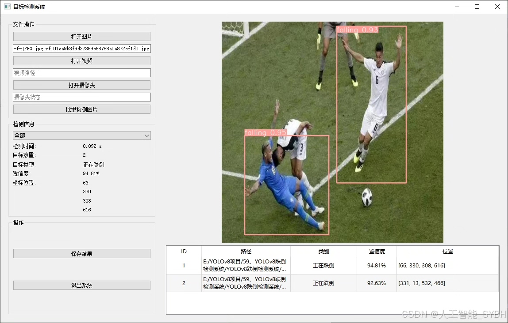
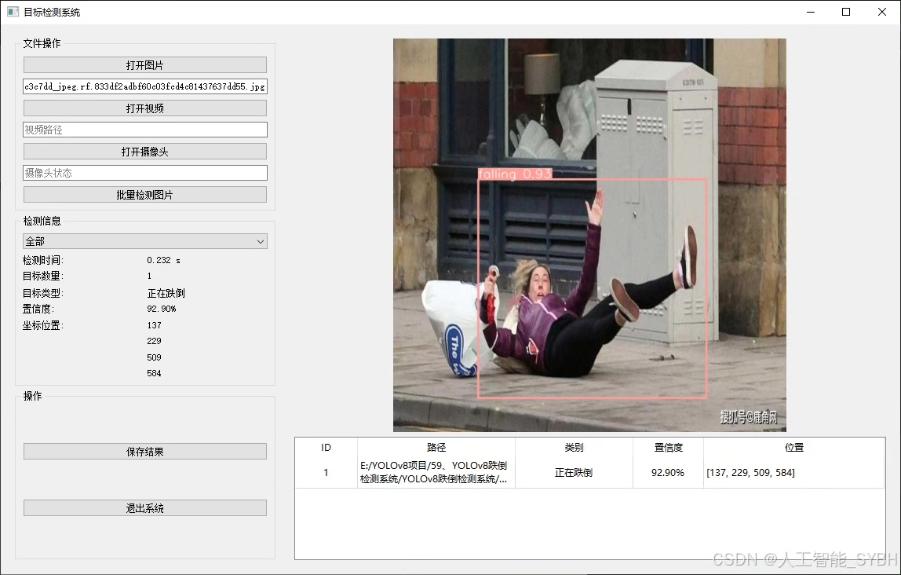
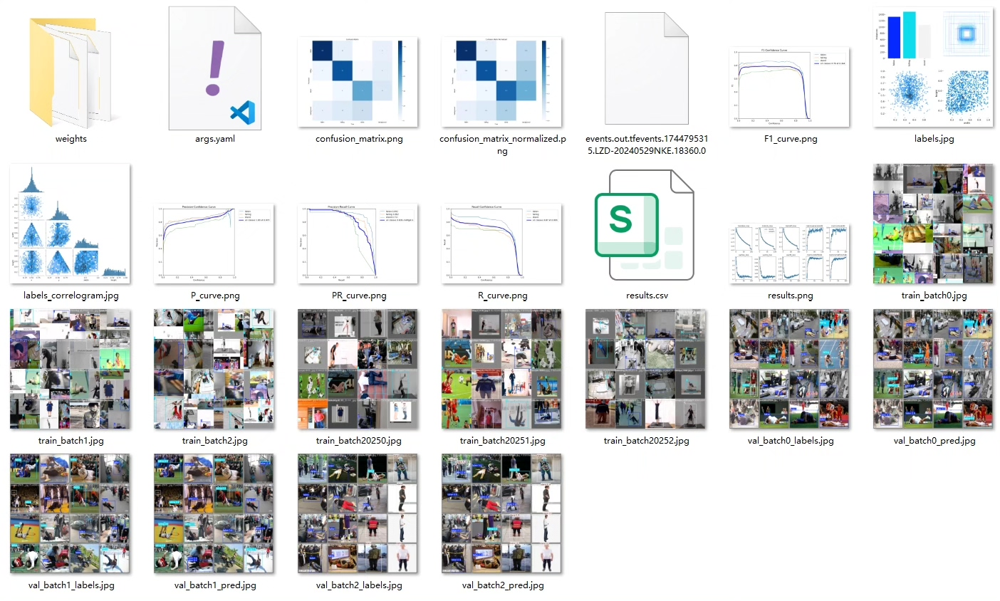
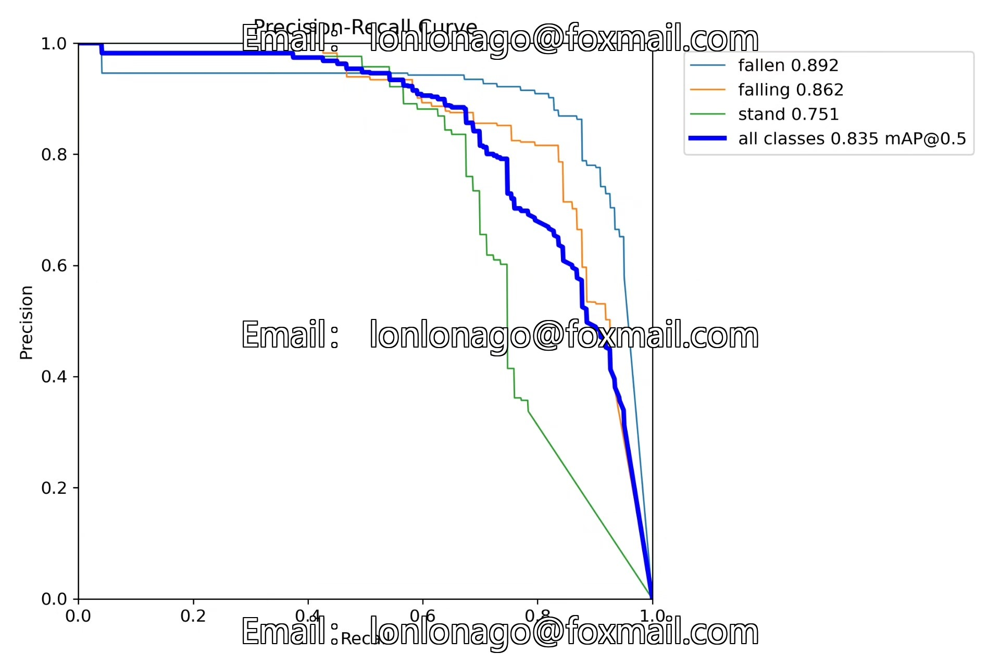
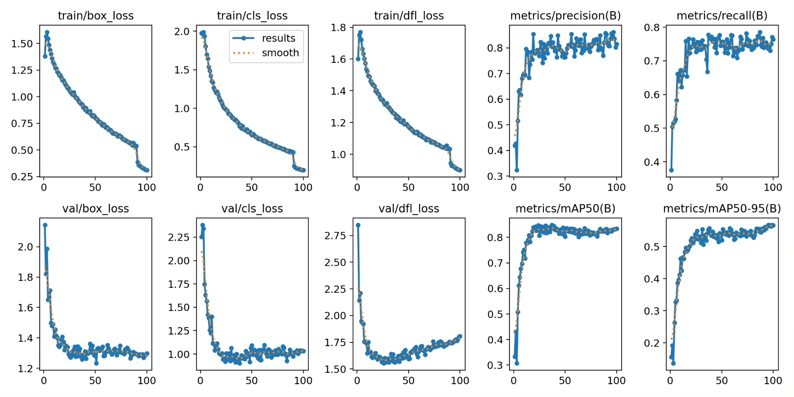
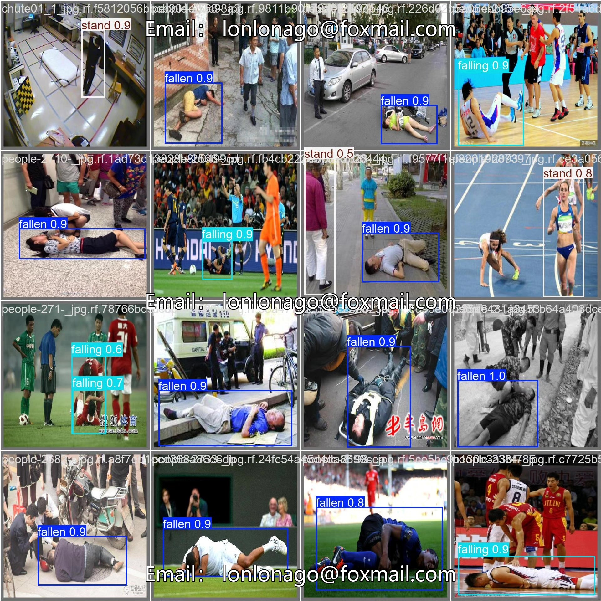
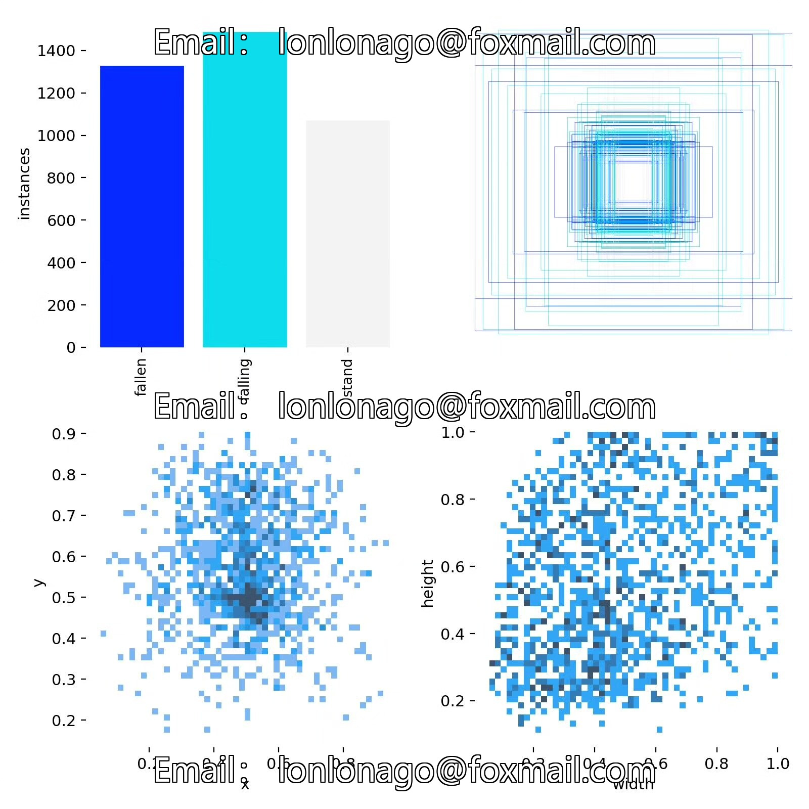
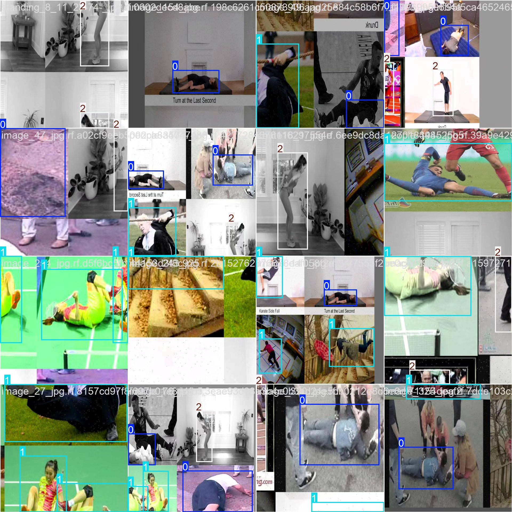

# Based on YOLOv8 deep learning for fall detection system (YOLOv8+YOL)

## Body

Based on the YOLOv8 deep learning algorithm, this project has developed an efficient and real-time fall detection system. It can accurately identify three types of human behavior states: fallen (fallen), falling (falling), and standing (stand). This system can be widely applied in nursing homes, hospitals, family care, and public safety monitoring. It aims to promptly detect falls and trigger alarms to reduce the risk of injuries caused by falls.

The dataset used in this system contains 3,888 labeled images, including 3,594 training images, 294 validation images, covering different scenarios (such as indoors, outdoors), different postures (such as sitting, lying down, walking), and different lighting conditions for falling behavior, to improve the generalization ability of the model. The experimental results show that this system performs high accuracy and real-time performance in the task of fall detection, meeting the practical application needs.

Our company's products have obtained the official commercial license certification from YOLO.

We provide after-sales service.

After payment, we will provide a WeChat account for any questions.

Environment configuration: We will provide a tutorial on environment configuration, and WeChat will provide answers.

Remote installation service: If you need remote configuration, an additional fee of 69 is required, with all fees refunded if the configuration fails (only refund installation fees for special old computers).

Retraining dataset: After configuring the environment, you can train on your own computer. If you need us to retrain, just pay 69 plus computing power fees (2.5 yuan/hour).

Full after-sales service

## Images

## Payment

Here is a pay link on Stripe ( https://buy.stripe.com/3cs8yP7sY87d0vu9AB ). Please contact me lonlonago@foxmail.com after funding $89, and I will send you a complete data files , thank you!

